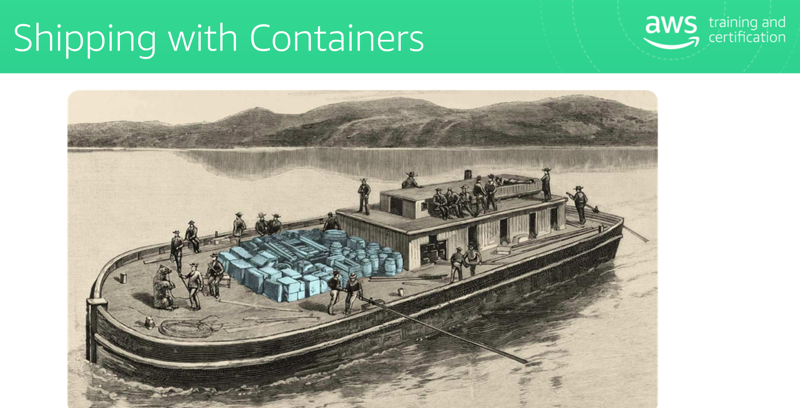
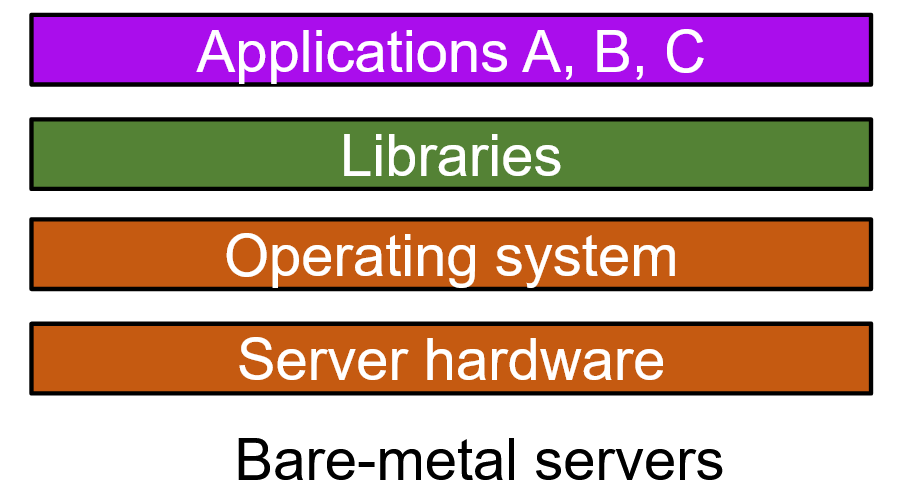
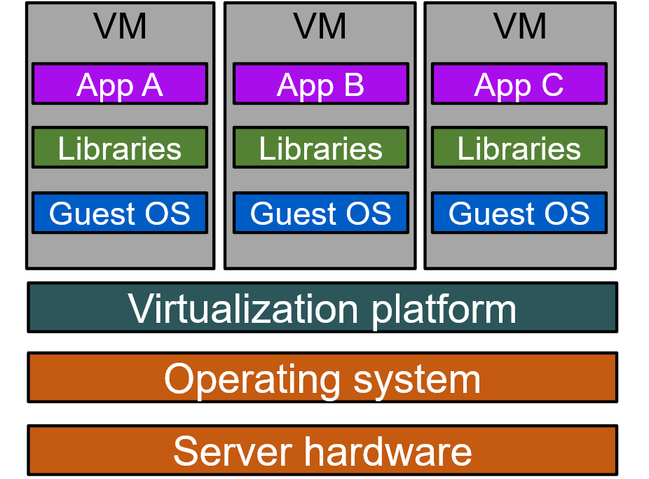
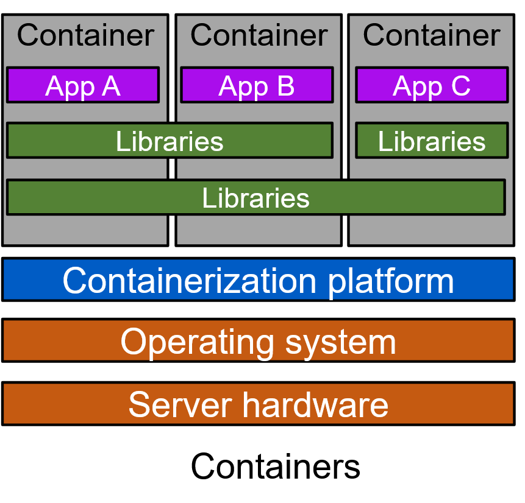
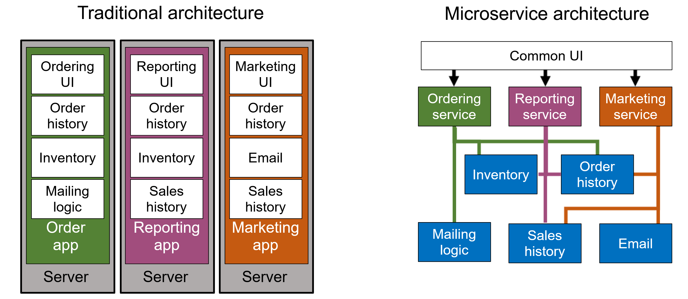

# Why Containers?

International shipping containers came later, fixing that

Contian everything needed to run app; settings, dependencies, etc.
A server can hold multiple Containers

"Bare-Metal" Servers have an OS, with Libs, with Apps--all jammed together. 
Inefficient--hardware costs are the same, regardless of use
Incompatibility creats issues too--what if you need two versions of the same thing?

> Bare Metal Servers: inefficient. Dependency Problems. Sync issues between apps and 
 

> VMS: Very Heavy VM Layer; multiple OS's stored
 

> Containers: Software is isolated and therefore portable

> Docker: 
- Package app dependencies in a **single, immutable artifact**

> Image:
- Readonly, Immutable Template with instructions for creating a Container; Typically a modified version of some base-image
- Dockerfiles feel kindof like Devops configurations; it's just another automation tool.
- Container=instance of an image (has a thin R/W layer that is run when the image is started)
- When the container is deleted, its R/W layer is also deleted. 
- Container's aren't really about storage--they're mostly about *compute*

- Decentralized, evolutionary design; No Service bus, 
- Smart Endpoints, dumb pipes
- Independent products, not projects
- Designed to handle failure
- Desposability
- Containers allow for Parity between Environments
- **Docker Registry** = storage and distribution system for named Docker Images
