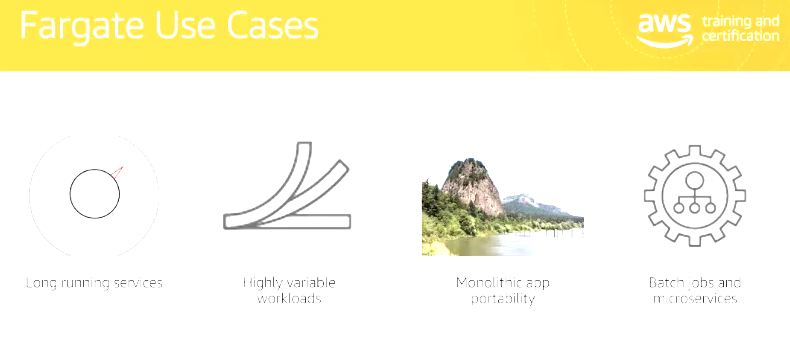
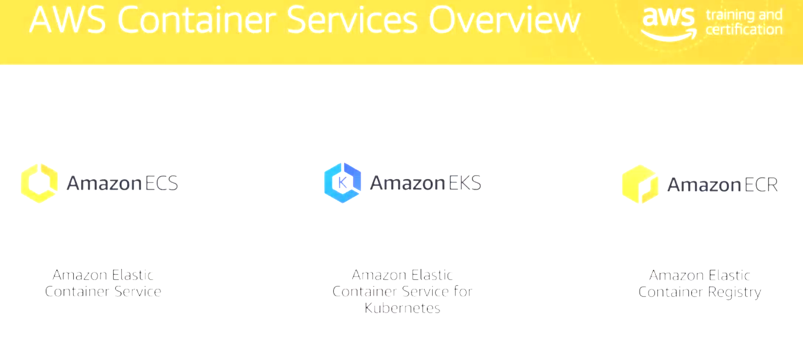

- Working to make the shift to containerization as easy as possible
- Faregate is is a tool for Deploying Infrastrucutre; Fully Managed Infrastrucutre; sclable. No worries about patching/updating/scalilng servers.
- Makes Running Containers the focus for Developers
- No need to Provision or Update servers to meet such needs
- "ECS" = "Elastic Container Service"
- "EKS" = "Elastic Container Service for Kubernetes"
- Only pay for resources you use.
- Usable through the **AWS CLI**, or the **AWS Console**, or the **Amazon ECS CLI**
- Load Balancing: **ALB** = Application Load Balancing, **NLB** = Network Load Balancing. 

EC2 is the best (not Fargage) for Windows

- **Amazon ECS**: Designed from the ground up to be able to easily integrate with other Amazon capabilities
- **Amazon EKS**: Built from unmodified Upstream Kubernetes. 
- **Amazon ECR**: Registry for managing Docker Container Registries. No need to worry about managing our own container repositories. 

